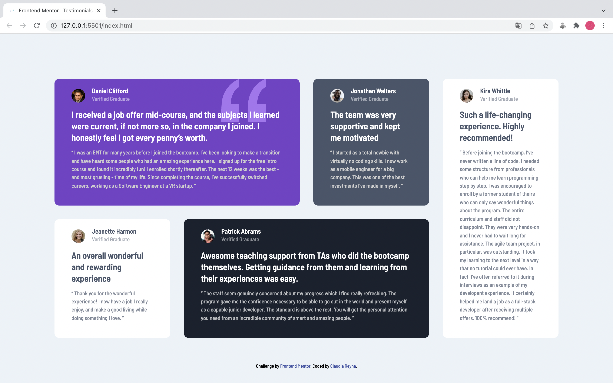

# Frontend Mentor - Testimonials grid section

This is a solution to the [Testimonials grid section](https://www.frontendmentor.io/challenges/testimonials-grid-section-Nnw6J7Un7). Frontend Mentor challenges help you improve your coding skills by building realistic projects. 

## Table of contents

- [Overview](#overview)
  - [The challenge](#the-challenge)
  - [Screenshot](#screenshot)
  - [Links](#links)
- [My process](#my-process)
  - [Built with](#built-with)
  - [What I learned](#what-i-learned)
  - [Continued development](#continued-development)
  - [Useful resources](#useful-resources)
- [Author](#author)
- [Acknowledgments](#acknowledgments)


## Overview

### The challenge

Your challenge is to build out this testimonials grid section and get it looking as close to the design as possible.

You can use any tools you like to help you complete the challenge. So if you've got something you'd like to practice, feel free to give it a go.


### Screenshot




### Links

- [Solution URL](https://github.com/claurey/testimonials-grid-section)
- [Live Site URL](https://claurey.github.io/testimonials-grid-section/)

## My process

### Built with

- Semantic HTML5 markup
- CSS custom properties
- Flexbox


### What I learned

I learned to use Flexbox to organize components.
```css
.container__section--white{

    flex:1 0 10rem;
    background-color: var(--primary-white);

}
```


## Author

- Website - [https://github.com/claurey](https://github.com/claurey)
- Frontend Mentor - [@claurey](https://www.frontendmentor.io/profile/claurey)
- Twitter - [@claurey591](https://www.twitter.com/claurey591)

